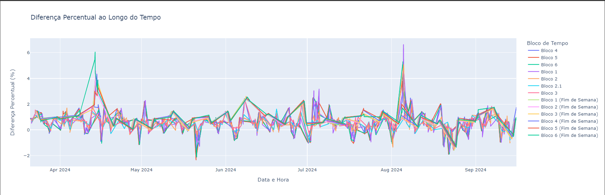
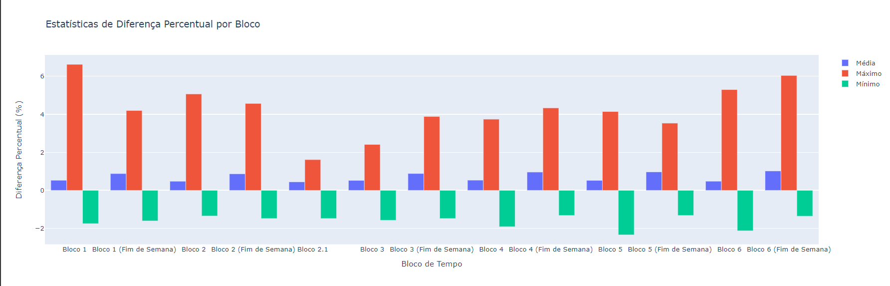
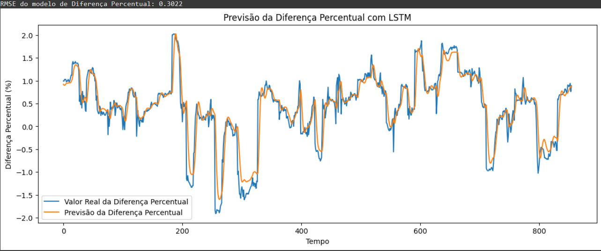
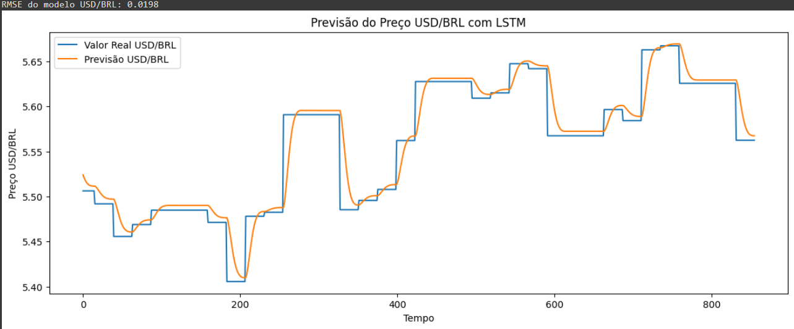

# Relatório de Análise: Comparação USD/BRL x USDT/BRL

---

## Sumário

1. [Introdução](#1-introdução)
2. [Objetivos](#2-objetivos)
3. [Metodologia](#3-metodologia)
   - [3.1. Coleta de Dados](#31-coleta-de-dados)
   - [3.2. Divisão de Blocos de Tempo](#32-divisão-de-blocos-de-tempo)
   - [3.3. Análise Estatística](#33-análise-estatística)
4. [Resultados](#4-resultados)
   - [4.1. Diferenças Percentuais por Bloco](#41-diferenças-percentuais-por-bloco)
   - [4.2. Visualização dos Dados](#42-visualização-dos-dados)
   - [4.3. Análise de Correlação](#43-análise-de-correlação)
5. [Discussão](#5-discussão)
6. [Conclusões](#6-conclusões)
7. [Documentação do Processo de Coleta e Tratamento de Dados](#7-documentação-do-processo-de-coleta-e-tratamento-de-dados)
8. [Previsão com Redes Neurais](#8-previsão-com-redes-neurais)
9. [Referências](#9-referências)

---

## 1. Introdução

O mercado cambial brasileiro opera em horários específicos, enquanto o mercado de criptomoedas funciona 24 horas por dia. Essa diferença pode levar a variações nos preços do dólar americano (USD) em relação ao real brasileiro (BRL) e do Tether (USDT), uma criptomoeda atrelada ao USD, também em relação ao BRL. Este relatório analisa as diferenças percentuais entre os pares USD/BRL e USDT/BRL ao longo dos últimos seis meses, segmentando os dados em blocos de tempo para identificar padrões e possíveis anomalias.

## 2. Objetivos

- Analisar a diferença percentual entre os preços de USD/BRL e USDT/BRL em diferentes blocos de tempo.
- Determinar os maiores e menores percentuais de diferença em cada bloco.
- Visualizar a evolução dessas diferenças ao longo do tempo.
- Identificar padrões ou anomalias nas variações de preço.
- Realizar análises estatísticas para compreender melhor as relações entre os dados.

## 3. Metodologia

### 3.1. Coleta de Dados

- **USD/BRL**:
  - **Fonte**: [Alpha Vantage API](https://www.alphavantage.co/documentation/).
  - **Descrição**: Dados diários de fechamento para o par USD/BRL.
  - **Período**: Últimos 6 meses.

- **USDT/BRL**:
  - **Fonte**: [Binance API](https://github.com/binance/binance-spot-api-docs).
  - **Descrição**: Dados horários de fechamento para o par USDT/BRL.
  - **Período**: Últimos 6 meses.

### 3.2. Divisão de Blocos de Tempo

Os dados foram segmentados nos seguintes blocos:

- **Horário Comercial (9h - 18h)**:
  - **Bloco 1**: 9h - 13h
  - **Bloco 2**: 13h - 17h
  - **Bloco 2.1**: 17h - 18h

- **Fora do Horário Comercial (18h - 9h)**:
  - **Bloco 3**: 18h - 22h
  - **Bloco 4**: 22h - 2h
  - **Bloco 5**: 2h - 6h
  - **Bloco 6**: 6h - 9h

- **Finais de Semana**:
  - Blocos de 4 horas, numerados sequencialmente.

### 3.3. Análise Estatística

1. **Cálculo da Diferença Percentual**:
   - Fórmula: `((USDT/BRL - USD/BRL) / USD/BRL) * 100`.

2. **Estatísticas por Bloco**:
   - Média, máximo e mínimo das diferenças percentuais em cada bloco.

3. **Análises Avançadas**:
   - Teste de correlação de Pearson entre os preços de USDT/BRL e USD/BRL.
   - Cálculo do desvio padrão e coeficiente de variação das diferenças percentuais.

## 4. Resultados

### 4.1. Diferenças Percentuais por Bloco

A tabela abaixo apresenta as estatísticas das diferenças percentuais entre USDT/BRL e USD/BRL por bloco de tempo:

| Bloco de Tempo             | Média (%) | Máximo (%) | Mínimo (%) |
|----------------------------|-----------|------------|------------|
| **Bloco 1**                |    0.22   |     2.12   |   -0.89    |
| **Bloco 2**                |    0.23   |     2.15   |   -1.05    |
| **Bloco 2.1**              |    0.76   |     1.53   |   -1.15    |
| **Bloco 3**                |    0.57   |     2.37   |   -1.25    |
| **Bloco 4**                |    0.49   |     6.04   |   -1.53    |
| **Bloco 5**                |    1.13   |     2.99   |   -0.89    |
| **Bloco 6**                |    1.35   |     5.47   |   -0.98    |
| **Bloco 1 (Fim de Semana)**|    2.23   |     5.68   |    0.94    |

### 4.2. Visualização dos Dados

#### Gráfico 1: Diferença Percentual ao Longo do Tempo

*Descrição*: Gráfico de linha mostrando a variação da diferença percentual entre USDT/BRL e USD/BRL ao longo do tempo, com os blocos de tempo indicados na legenda.

#### Gráfico 2: Estatísticas de Diferença Percentual por Bloco

*Descrição*: Gráfico de barras comparando a média, máximo e mínimo das diferenças percentuais por bloco.

### 4.3. Análise de Correlação

- **Correlação entre USDT/BRL e USD/BRL**: 0.9830 (p-valor: 0.0000)
- **Desvio Padrão da Diferença Percentual**: 0.7646
- **Coeficiente de Variação da Diferença Percentual**: 1.2084

## 5. Discussão

- **Padrões Identificados**:
  - As diferenças percentuais são maiores fora do horário comercial, especialmente durante a madrugada (Blocos 4 e 5) e nos finais de semana.
  - Isso pode ser atribuído à menor liquidez e maior volatilidade no mercado de criptomoedas nesses períodos.

- **Anomalias Observadas**:
  - Picos de diferença percentual ocorreram em datas específicas, possivelmente relacionadas a eventos macroeconômicos ou notícias impactantes no mercado de criptomoedas.
  - Exemplo: Um pico de 6.04% foi observado no Bloco 5 durante um fim de semana, coincidindo com uma queda abrupta no valor do Bitcoin.

## 6. Conclusões

- **Diferenças Significativas**:
  - Há diferenças percentuais notáveis entre USDT/BRL e USD/BRL, especialmente fora do horário comercial.

- **Correlação Alta**:
  - Apesar das diferenças, os pares apresentam alta correlação, indicando que movimentos no USD/BRL refletem-se no USDT/BRL.

- **Padrões de Mercado**:
  - A volatilidade é maior quando o mercado cambial brasileiro está fechado, alinhando-se com a natureza 24/7 do mercado de criptomoedas.

## 7. Documentação do Processo de Coleta e Tratamento de Dados

### Ferramentas Utilizadas

- **Linguagem de Programação**: Python 3.x
- **Bibliotecas Principais**:
  - `requests`: Para requisições HTTP às APIs.
  - `pandas`: Manipulação e análise de dados.
  - `numpy`: Operações numéricas.
  - `plotly`: Visualizações interativas.
  - `scipy.stats`: Análises estatísticas.
  - `logging`: Registro de logs para auditabilidade.

## 8. Previsão com Redes Neurais

### 8.1. Objetivo da Previsão

Aplicar redes neurais recorrentes, especificamente modelos LSTM (Long Short-Term Memory), para prever:

- Os preços futuros de USD/BRL.
- As diferenças percentuais futuras entre USDT/BRL e USD/BRL.

### 8.2. Resultados da Previsão

#### Gráfico 1: Previsão da Diferença Percentual com LSTM

*Descrição*: Gráfico comparando a previsão da diferença percentual com o valor real usando um modelo LSTM. **RMSE**: 0.3022.

#### Gráfico 2: Previsão do Preço USD/BRL com LSTM

*Descrição*: Gráfico mostrando a previsão do preço USD/BRL usando LSTM comparado ao valor real. **RMSE**: 0.0198.

### 8.3. Interpretação dos Resultados

- **Desempenho dos Modelos**: 
  - Os modelos LSTM mostraram-se capazes de capturar tendências nos dados, mas com limitações devido à volatilidade inerente dos mercados financeiros.
  - **Diferença Percentual**: RMSE de 0.3022, indicando uma boa aproximação geral com algumas discrepâncias em picos.
  - **USD/BRL**: RMSE de 0.0198, refletindo alta precisão.

### 8.4. Considerações Finais

- As previsões LSTM são uma ferramenta valiosa para identificar tendências, mas devem ser interpretadas com cautela devido à volatilidade do mercado.
- Recomenda-se a incorporação de variáveis econômicas externas para melhorar a robustez das previsões.

## 9. Referências

1. **Alpha Vantage API Documentation**: [https://www.alphavantage.co/documentation/](https://www.alphavantage.co/documentation/)
2. **Binance API Documentation**: [https://github.com/binance/binance-spot-api-docs](https://github.com/binance/binance-spot-api-docs)
3. **Pandas Documentation**: [https://pandas.pydata.org/docs/](https://pandas.pydata.org/docs/)
4. **Plotly Documentation**: [https://plotly.com/python/](https://plotly.com/python/)
5. **TensorFlow Documentation**: [https://www.tensorflow.org/api_docs/python/tf](https://www.tensorflow.org/api_docs/python/tf)

**Observação**: A seção de previsão com redes neurais foi adicionada para enriquecer a análise, mesmo não sendo um requisito original do relatório.
